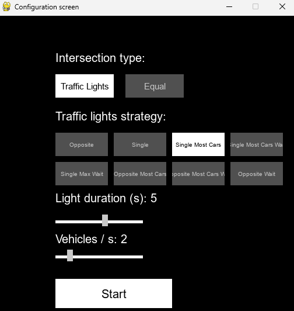
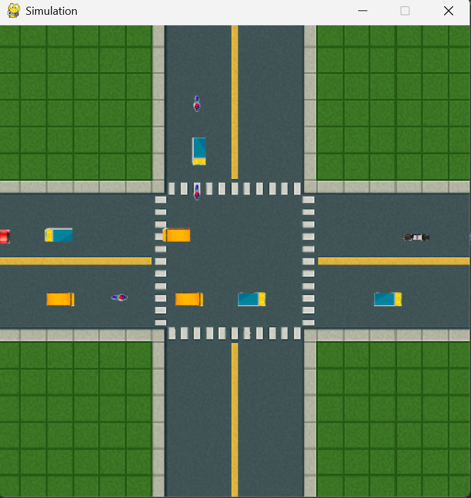
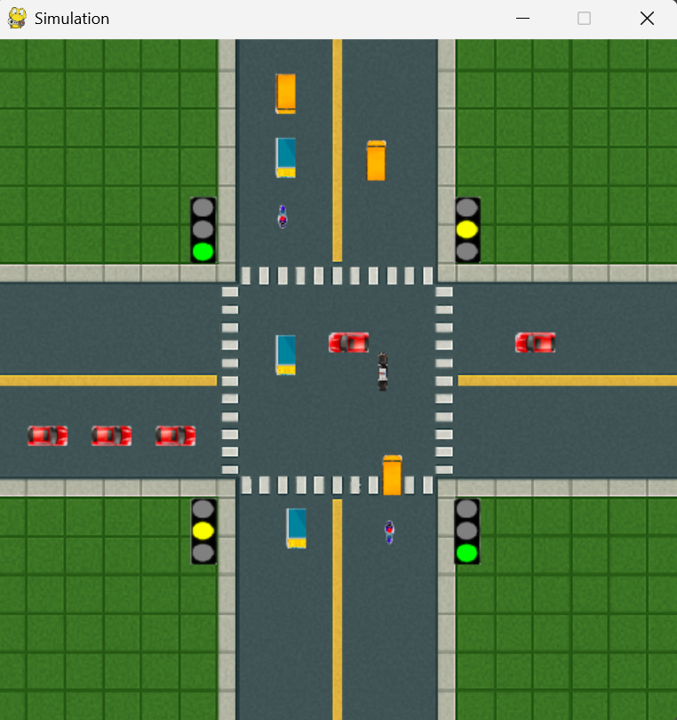

# Traffic-simulator
## Table of contents:
* [General info](#general-info)
* [Description](#description)
* [Simulation functionalities](#simulation-functionalities)
* [Data analysis](#data-analysis)
* [Project structure](#project-structure)
* [Requirements](#requirements)
* [Setup](#setup)
### General info
This project was developed as part of the Modeling and Simulation of Systems course. The goal was to implement a traffic simulation for a single intersection using agent-based modeling and the Pygame environment.
### Description
The simulator models urban traffic at one intersection. It uses a modular Domain-Driven Design (DDD) structure to separate core logic from UI and analysis.
Core elements include:
* Autonomous vehicles with different types and behaviors.
* Intersections with two control modes: right-of-way rule or traffic lights.
* Traffic lights governed by configurable switching strategies.
* Realtime GUI rendering of the simulation.

Simulation is parameterized by:
* Vehicle arrival rate (e.g. 1 or 3 vehicles/second),
* Traffic light strategy (fixed, most cars, longest wait, etc.),
* Green light duration.
### Simulation functionalities
Key features of the simulation include:

* Agent-based movement of multiple types of vehicles: cars, trucks, bicycles, buses, police.

* Intersection logic handling priorities and traffic flow.

* Configurable traffic intensity (e.g., vehicles per second).

* Support for 8 traffic light strategies, including:

  * Fixed cycle (SINGLE/OPPOSITE),
  * Most cars (SINGLE/OPPOSITE)
  * Most cars waiting (SINGLE/OPPOSITE),
  * Maximum wait time (SINGLE/OPPOSITE).

* Adjustable green light duration per strategy.
* Real-time animation using Pygame.
* CSV logging of traffic throughput for further analysis.

#### Screenshots


<br>
<br>
<div style="display: flex; gap: 20px; justify-content: center; align-items: center;">

  <div style="text-align: center;">
    
    <p>Equal Intersection</p>
  </div>

  <div style="text-align: center;">
    
    <p>Traffic Lights Intersection</p>
  </div>

</div>

#### Demo

<div style="display: flex; gap: 20px; justify-content: center; align-items: center;">

  <div style="text-align: center;">
    
    <p>Equal Intersection</p>
  </div>

  <div style="text-align: center;">
    
    <p>Traffic Lights Intersection</p>
  </div>

</div>


### Data analysis
CSV files are generated during simulation and updated every second. Each file corresponds to a specific intersection configuration and contains:
* time (ms)
* vehicles_count – cumulative number of vehicles that have left the intersection
The analysis includes:
* Traffic throughput comparison between intersection types
* Evaluation of each traffic light strategy under various vehicle arrival rates (e.g. 1 or 3 cars per second)
The goal was to identify the most efficient strategy for minimizing congestion and maximizing vehicle flow.
### Project structure
```
Traffic-simulator/
├── data/                        # Simulation output (CSV files grouped by parameters)
├── data_analysis/               # Notebooks and scripts for analyzing simulation output
├── simulation/
│   ├── application/             # Simulation engine and main loop
│   ├── domain/                  # Core logic (DDD structure)
│   │   ├── aggregates/          # Main controllers, e.g. TrafficSystem
│   │   ├── entities/            # Vehicle, Intersection, TrafficLight, etc.
│   │   ├── models/              # Enums: Position, IntersectionType, Direction, etc.
│   │   └── services/            # Logic: light switching strategies, priority rules, vehicle movement
│   ├── file_io/                 # CSV saving logic
│   ├── ui/                      # User interface with pygame (buttons, renderers, presenters)
│   └── main.py                  # Entry point to run the simulation
│   └── config.py                # Global configuration for simulation and UI
```
### Requirements
* Python 3.12+
* pygame
* pandas
* matplotlib
### Setup

